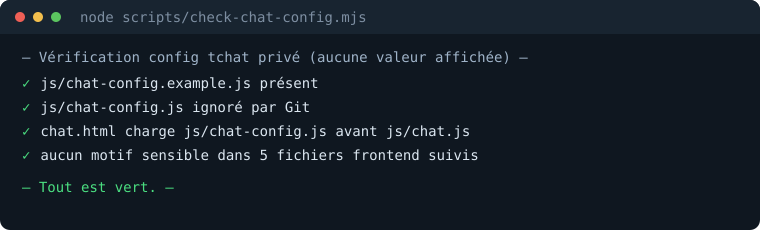

[Français](README.md) · **English**

# KDL Tchat

The private real-time chat module of [kdl-tech.fr](https://kdl-tech.fr), released as open
source: a static, build-free JavaScript frontend on Supabase, with security resting
entirely on Postgres rules rather than on a trusted backend.

```bash
git clone https://github.com/Kdl-Tech/kdl-tech-chat.git
cd kdl-tech-chat
cp js/chat-config.example.js js/chat-config.js   # public keys only
node scripts/check-chat-config.mjs               # checks that no secret leaks
```



## What this repository is worth reading for

A frontend that holds **no secret at all**. No service key, no privileged endpoint, no
trusted middle tier: the browser only ever receives the project URL and the public `anon`
key, and everything else is arbitrated by Postgres Row Level Security. If you build on
Supabase, `supabase/schema.sql` is the part worth reading.

| | |
|---|---|
| **Authentication** | email/password and Google, through Supabase Auth |
| **Real time** | Supabase Realtime, no polling |
| **Isolation** | RLS on every table: nothing is readable unless authenticated and not banned |
| **Anti-XSS** | all user content rendered with `textContent`, never `innerHTML` |
| **Anti-bot** | Cloudflare Turnstile wired into `signUp` and `signIn` |
| **Moderation** | soft deletion and bans reserved for staff |
| **Build step** | none. Three JS files and one HTML page |

## Why there is no UPDATE policy on messages

Deleting a message does not go through a policy but through a `security definer` function
(`soft_delete_message`). That is not a stylistic choice: an `UPDATE` policy **could not
work**.

PostgreSQL requires the modified row to remain visible under the `SELECT` policy of
whoever modifies it. Here a deleted message becomes invisible to its own author — only
staff see deleted messages. So the author's `UPDATE` violated their own read policy and
failed with `42501` every time. That behaviour surfaced by running the real RLS tests, not
by rereading the documentation.

A useful consequence: a posted message is **immutable** on the client side. No `UPDATE` or
`DELETE` policy exists, so no client can rewrite history, even holding the public key.

## What it does not do

- **It is not a turnkey service.** You need your own Supabase project: apply
  `supabase/schema.sql`, then fill in `js/chat-config.js`.
- **It is not visually self-contained.** The `css/style.css` stylesheet belongs to the
  kdl-tech.fr site and is not part of this repository: served on its own, the HTML renders
  unstyled.
- **No end-to-end encryption.** Messages are readable by the Supabase project
  administrator, as in any moderated room.
- **Public deployment is not live.** The code is complete and tested; putting it online on
  kdl-tech.fr is still to be done.

## Setting it up

1. Create a Supabase project and run `supabase/schema.sql` in the SQL editor.
2. Copy `js/chat-config.example.js` to `js/chat-config.js` (gitignored) and fill in the
   project URL, the `anon` key and the Turnstile site key — **public values only**.
3. Check the rules with `supabase/tests_rls.sql`, which replays the edge cases: anonymous
   read, banned user, someone else's message, staff deletion.
4. Serve `chat.html` alongside your site's stylesheet.

Run `node scripts/check-chat-config.mjs` before each commit: it refuses to let a secret
pattern through in tracked files, and verifies that the local configuration is properly
ignored by Git.

## Licence

MIT — see [LICENSE](LICENSE).

---

**KDL TECH** — IT repair, software development and tooling.
[kdl-tech.fr](https://kdl-tech.fr)
